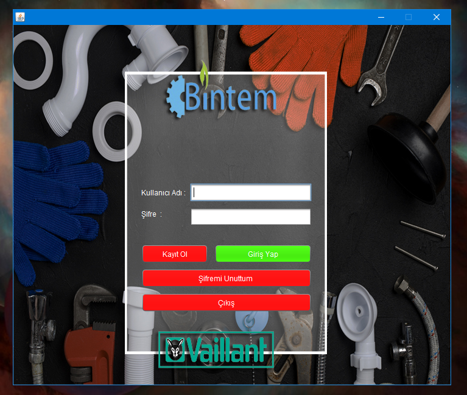
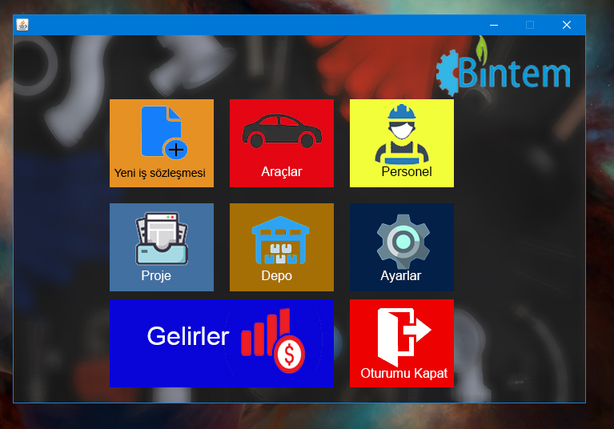
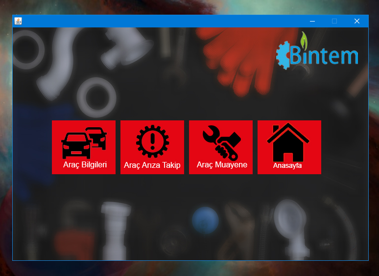
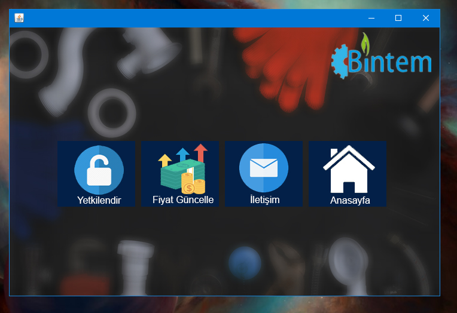
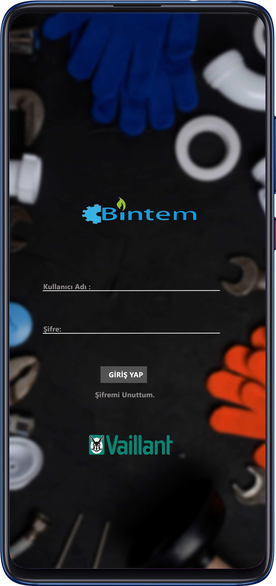

# proje -  Personel - Araç - Depo - Gelir Takip ve yönetim sistemi  

### İÇİNDEKİLER
- Proje Amacı ve Özellikleri
- Proje Görselleri

## Proje Amacı
Sistem masaüstü ve mobil uygulamaya sahiptir. Sistem içerisinde yeni proje açma ve var olan projelerin takibini sağlama, personel maliyetlerini hesaplama ve görüntüleme, Araçların fatura ve giderlerini görüntüleme, Depo stok durumlarının kontrolünü sağlama, Aylık gelir ve gider takibinin yapılmasına olanak sağlar. 

### - Proje Görselleri

